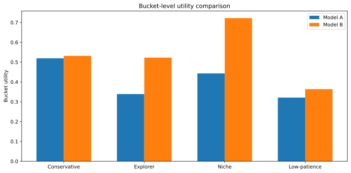

# limitation

This repository is the public home for a focused v1:

> Behavioral QA for recommender systems

This v1 is a public, reproducible test harness for comparing a baseline recommender against a candidate recommender and surfacing what aggregate offline metrics miss.

It is built around a simple pre-launch question:

> Should I trust this new recommender before I ship it?

## The Problem

Offline metrics like Recall@10 and NDCG@10 are useful, but they can hide important differences:

- which user segments improve
- which user segments regress
- whether the candidate becomes more novel or more repetitive
- whether it collapses toward head items
- what short recommendation trajectories feel like

This repo turns that gap into one clean public proof on MovieLens 100K.

## What The Tool Does

The canonical demo compares:

- `Model A`: popularity baseline
- `Model B`: genre-profile recommender with popularity prior

Across one fixed setup:

- MovieLens 100K
- fixed train/test split
- fixed 4 user buckets
- fixed metrics
- fixed seed/config

Each run produces:

- aggregate offline metrics
- per-bucket results
- behavioral diagnostics
- short trajectory examples

## Canonical Result

The official demo currently shows the core product value clearly:

- aggregate offline metrics favor `Model A`
- the bucketed view shows `Model B` is much stronger for Explorer and Niche-interest users
- `Model B` is more novel and less catalog-concentrated

That is the hidden-tradeoff insight this tool is designed to catch.



Official artifact bundle:

- [Report](studies/01-recommender-offline-eval/artifacts/canonical/official_demo_report.md)
- [JSON results](studies/01-recommender-offline-eval/artifacts/canonical/official_demo_results.json)
- [Chart](studies/01-recommender-offline-eval/artifacts/canonical/bucket_utility_comparison.svg)

## Buckets

- `Conservative mainstream`: prefers familiar, high-exposure items and tolerates safe recommendations.
- `Explorer / novelty-seeking`: values discovery and variety, and rewards less familiar items.
- `Niche-interest`: benefits when the model can match narrower parts of the catalog.
- `Low-patience`: needs good recommendations quickly and degrades faster under stale sequences.

## Run It

Script path:

```bash
python3 -m venv .venv
source .venv/bin/activate
make install
make run
```

Notebook path:

```bash
make notebook
```

Refresh the committed canonical bundle:

```bash
make canonical
```

Run checks:

```bash
make lint
make test
```

## Repo Guide

- [studies/01-recommender-offline-eval](studies/01-recommender-offline-eval): study-local README, notebook, code, and artifact links
- [studies/01-recommender-offline-eval/docs/v1-product-spec.md](studies/01-recommender-offline-eval/docs/v1-product-spec.md): locked product spec
- [studies/README.md](studies/README.md): study index
- [Makefile](Makefile): common commands

Study-local `data/`, cache, and scratch `output/` directories stay ignored by git. The committed proof lives in `studies/01-recommender-offline-eval/artifacts/canonical/`.

## Background

The earlier write-up that motivated this direction is here:

https://dev.to/alankritverma/why-offline-evaluation-is-not-enough-for-recommendation-systems-15ii
