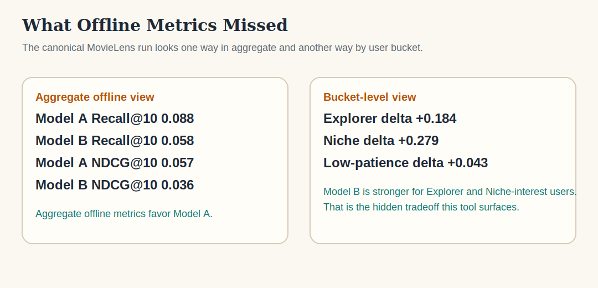

# limitation

This repository contains:

- a public recommender-evaluation proof under [studies/01-recommender-offline-eval](studies/01-recommender-offline-eval/README.md)
- the active product build under [products/interaction-harness](products/interaction-harness/README.md)

The short product thesis is:

> evaluate non-deterministic systems through interaction, not just offline metrics

Today the active implementation is recommender-first, but the longer-term goal is broader: a reusable interaction-testing harness for systems that need scenario-based, trajectory-level evaluation.

## Current Product State

The interaction harness is now a real working product skeleton, not just a plan.

It currently includes:

- a real HTTP-shaped system boundary
- a local artifact-backed reference recommender service
- a mock service kept only for narrow tests
- seeded synthetic users with explicit multi-step state
- deterministic judging, cohort analysis, and failure surfacing
- report-only baseline-vs-candidate regression runs across reruns
- polished markdown, JSON, and trace artifacts

The study remains the proof. The interaction harness is the product direction.

## The Problem

Offline metrics like `Recall@10` and `NDCG@10` are useful, but they can hide important differences:

- which user segments improve
- which user segments regress
- whether the candidate becomes more novel or more repetitive
- whether recommendations collapse toward head items
- what short recommendation trajectories actually look like

## Canonical Result

The official MovieLens 100K demo shows the core product value clearly:

- aggregate offline metrics favor `Model A`, the popularity baseline
- bucketed diagnostics show `Model B` is much stronger for Explorer and Niche-interest users
- `Model B` is more novel and less catalog-concentrated

That is the hidden-tradeoff insight this tool is designed to catch.

## Where To Start

If you want the active product:

- read [products/interaction-harness/README.md](products/interaction-harness/README.md)
- then read the active roadmap in [plans/interaction-harness-v0/README.md](plans/interaction-harness-v0/README.md)

If you want the original public proof:

- read [studies/01-recommender-offline-eval/README.md](studies/01-recommender-offline-eval/README.md)

## What Offline Metrics Missed



## Official Artifacts

- [Canonical report](studies/01-recommender-offline-eval/artifacts/canonical/official_demo_report.md)
- [Canonical JSON results](studies/01-recommender-offline-eval/artifacts/canonical/official_demo_results.json)
- [Bucket utility chart](studies/01-recommender-offline-eval/artifacts/canonical/bucket_utility_comparison.svg)
- [Canonical result snapshot](studies/01-recommender-offline-eval/artifacts/canonical/canonical_result_snapshot.svg)
- [Robustness note](studies/01-recommender-offline-eval/artifacts/canonical/robustness_summary.md)
- [Robustness JSON](studies/01-recommender-offline-eval/artifacts/canonical/robustness_results.json)

## Trust Note

- Frozen: MovieLens 100K, 2 models, 4 fixed buckets, fixed report structure, fixed canonical config.
- Diagnostic: bucket utility, novelty, repetition, concentration, and short traces are meant to make tradeoffs legible before launch.
- Stability checked: seeds `0`, `1`, and `2` were identical in this pipeline; a smaller holdout split preserved the same directional story.
- Out of scope: this is not a claim about all recommenders, all datasets, or online production truth.

## How To Interpret The Metrics

- `Recall@10` and `NDCG@10` are standard offline ranking metrics on held-out positives. They tell us how well each model recovers historical relevance under the evaluation split.
- `Bucket utility` is a short-session diagnostic. It asks whether a fixed evaluation lens, such as Explorer or Niche-interest, experiences the sequence as more useful.
- `Novelty` is higher when recommendations move away from the most exposed catalog items.
- `Repetition` is higher when recommendations stay closer to the user’s recent consumed items. Higher is not always better or worse on its own.
- `Catalog concentration` measures how much of the list comes from the most popular slice of the catalog.
- These behavioral metrics are useful diagnostics, not substitutes for online experiments.

## What The Buckets Are, And Are Not

- The 4 buckets are fixed v1 evaluation lenses: `Conservative mainstream`, `Explorer / novelty-seeking`, `Niche-interest`, and `Low-patience`.
- They are designed to make tradeoffs easy to see in one reproducible report.
- They are not meant to claim that all real users fall neatly into four true population segments.
- They are simplified, product-facing evaluation perspectives, not a full model of human behavior.

## Limitations Of This V1

- MovieLens 100K is one public benchmark, not the whole recommender world.
- The buckets are synthetic and intentionally simplified.
- The short traces are diagnostic illustrations, not full user simulations.
- The tool is strong for surfacing tradeoffs, but it does not replace online testing.

## Run It

Official demo:

```bash
python3 -m venv .venv
source .venv/bin/activate
make install
make run
```

Custom run with JSON config:

```bash
make run CONFIG=studies/01-recommender-offline-eval/examples/custom_csv_run.json
```

Refresh the full committed proof bundle:

```bash
make canonical
```

Notebook path:

```bash
make notebook
```

Checks:

```bash
make lint
make test
```

## Use Your Own Data

Custom datasets use a simple CSV contract:

- `interactions.csv` with `user_id`, `item_id`, `rating`, `timestamp`
- `items.csv` with `item_id`, `title`, and optional numeric or boolean feature columns

Feature columns are required when you use the built-in `genre_profile` model. Popularity-only comparisons can run without them.

Useful links:

- [Canonical JSON config](studies/01-recommender-offline-eval/examples/canonical_run.json)
- [Custom CSV JSON config](studies/01-recommender-offline-eval/examples/custom_csv_run.json)
- [Dataset schema](studies/01-recommender-offline-eval/docs/dataset-schema.md)

## Repo Guide

- [Interaction Harness README](products/interaction-harness/README.md)
- [Interaction Harness plans](plans/interaction-harness-v0/README.md)
- [Study 01 README](studies/01-recommender-offline-eval/README.md)
- [V1 product spec](studies/01-recommender-offline-eval/docs/v1-product-spec.md)
- [Canonical artifacts](studies/01-recommender-offline-eval/artifacts/canonical)
- [Source code](studies/01-recommender-offline-eval/src/recommender_offline_eval)
- [Tests](studies/01-recommender-offline-eval/tests)
- [Makefile](Makefile)

Study-local `data/`, cache, and scratch `output/` directories stay ignored by git. The committed public proof lives in `studies/01-recommender-offline-eval/artifacts/canonical/`.

## Background

The earlier write-up that motivated this direction is here:

https://dev.to/alankritverma/why-offline-evaluation-is-not-enough-for-recommendation-systems-15ii
